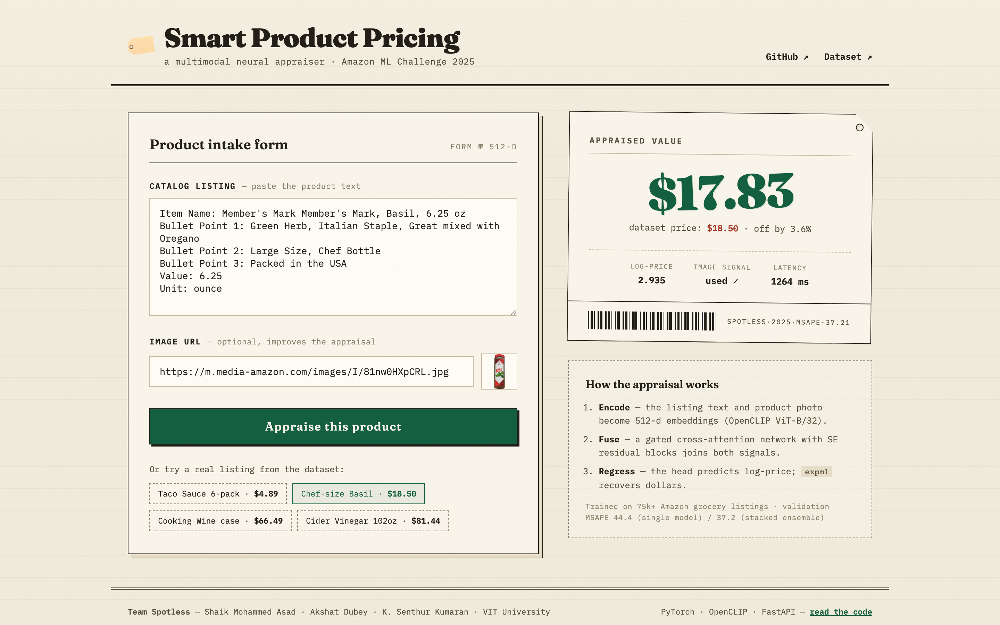
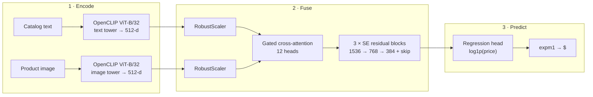

# 🏷️ Smart Product Pricing

**A multimodal neural network that appraises Amazon products — paste a listing, get a price.**

Built by **Team Spotless** for the **Amazon ML Challenge 2025** (Smart Product Pricing track). The model fuses a product's catalog text and photo through a gated cross-attention network to predict its price, reaching a **validation MSAPE of 37.21** with its stacked ensemble.

**[▶ Try the live demo](https://theshaikasad--smart-product-pricing.modal.run)** · [Dataset (Kaggle)](https://www.kaggle.com/datasets/suvroo/amazon-ml) · [Solution writeup (PDF)](docs/AMAZON_ML.pdf)



## Results

| Model variant | Description | Validation MSAPE |
| --- | --- | ---: |
| Standard | Multimodal cross-attention network | 44.40 |
| SWA | Stochastic-weight-averaged snapshot | 44.40 |
| **Stacked ensemble** | Image-only + text-only + multimodal heads, meta-learned blend | **37.21** |

The deployed app serves the multimodal cross-attention model; the stacked ensemble is fully reproducible from [`scripts/train_ensemble.py`](scripts/train_ensemble.py) and the [notebook](notebooks/EnsembleMethod.ipynb).

## How it works



1. **Dual-modal encoding** — the listing text and product photo are embedded into L2-normalized 512-d vectors with OpenCLIP ViT-B/32 (`laion2b_s34b_b79k`). Missing images are zero-filled, exactly as during training.¹
2. **Gated cross-attention fusion** — image queries attend to text keys/values (and to themselves); a sigmoid gate regulates how much fused signal flows forward. Squeeze-and-Excitation residual blocks recalibrate channels before progressive downscaling (1536 → 768 → 384) with a skip connection.
3. **Log-price regression** — trained with an adaptive MSE/MAE blend (α = 0.7), AdamW + cosine warm restarts, mixup and Gaussian-noise augmentation, SWA, and early stopping on validation MSAPE.
4. **Stacked ensemble** (best variant) — image-only and text-only MLP heads produce 5-fold out-of-fold predictions alongside the multimodal model; 17 engineered meta-features feed Ridge, Gradient Boosting, and a meta-MLP, blended with inverse-MSAPE weights.

¹ The original writeup mentions Flan-T5 for text encoding, but re-encoding the training data shows the shipped embeddings come from the CLIP text tower (cosine similarity 1.000 across verified samples) — see [`scripts/verify_encoders.py`](scripts/verify_encoders.py). This repo reproduces the artifacts.

## Repository layout

```
├── app/                  # FastAPI server + vanilla-JS frontend
│   ├── main.py           #   POST /api/predict, GET /health, static hosting
│   └── static/           #   the "appraiser's ledger" UI
├── src/pricing/          # inference package
│   ├── models.py         #   AdvancedPriceModel (gated cross-attention + SE blocks)
│   ├── encoders.py       #   OpenCLIP text/image embedding
│   ├── pipeline.py       #   PricePredictor: raw text + image URL → price
│   └── artifacts.py      #   checkpoint resolution (local file or HF Hub)
├── scripts/
│   ├── train_multimodal.py         # trains the cross-attention model
│   ├── train_ensemble.py           # trains the stacked ensemble (best MSAPE)
│   ├── verify_encoders.py          # proves which encoders produced the data
│   ├── export_deploy_checkpoint.py # slims the checkpoint for serving
│   └── upload_artifacts.py         # pushes weights to the HF Hub
├── notebooks/EnsembleMethod.ipynb  # original competition notebook
├── docs/AMAZON_ML.pdf              # solution writeup
├── modal_app.py                    # serverless deployment (Modal)
└── Dockerfile                      # container deployment (any Docker host)
```

## Run it locally

```bash
git clone https://github.com/theshaikasad/smart-product-pricing
cd smart-product-pricing
pip install -r requirements.txt

# fetches the checkpoint from the HF Hub on first run (~185 MB)
uvicorn app.main:app --port 7860
# → http://localhost:7860
```

Or use the predictor directly:

```python
import sys; sys.path.insert(0, "src")
from pricing import PricePredictor

predictor = PricePredictor()
result = predictor.predict(
    "Item Name: Organic Apple Cider Vinegar\nValue: 102.0\nUnit: Fl Oz",
    image_url="https://m.media-amazon.com/images/I/41SHfxsFz5L.jpg",
)
print(f"${result.price:.2f}")
```

## Reproduce the training

The training data (`train_combined.csv`) is the [challenge dataset](https://www.kaggle.com/datasets/suvroo/amazon-ml) with precomputed OpenCLIP embeddings for both modalities.

```bash
# 1. multimodal cross-attention model  → artifacts/advanced_price_model.pt
python scripts/train_multimodal.py --train-csv train_combined.csv

# 2. stacked ensemble on top of it     → artifacts/ensemble/
python scripts/train_ensemble.py --train-csv train_combined.csv --test-csv test_combined.csv
```

## Tech stack

PyTorch · OpenCLIP · scikit-learn · FastAPI · vanilla JS — deployed serverlessly on [Modal](https://modal.com) (`modal deploy modal_app.py`), weights on the [HF Hub](https://huggingface.co/theshaikasad/smart-product-pricing-artifacts). A `Dockerfile` is included for any container host.

## Team Spotless

[Shaik Mohammed Asad](https://github.com/theshaikasad) · Akshat Dubey · K. Senthur Kumaran — VIT University, Amazon ML Challenge 2025.

## License

[MIT](LICENSE)
